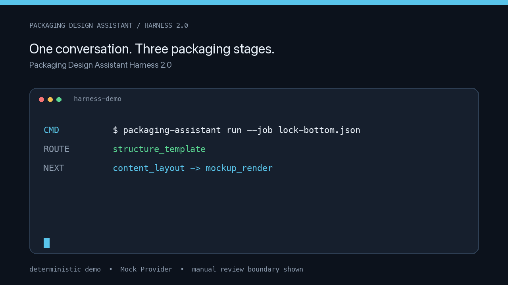
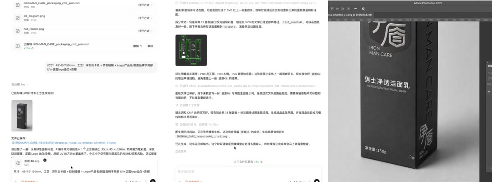
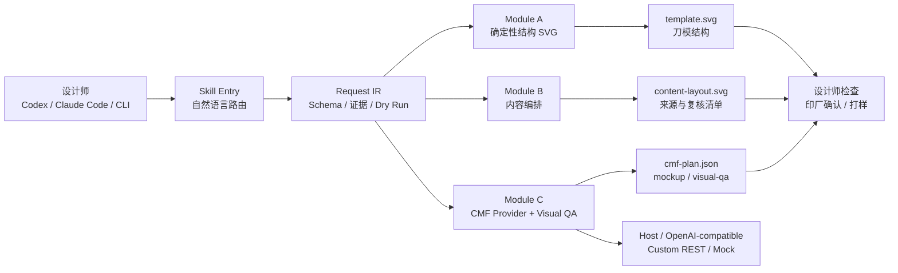

# 包装设计助理 Harness 2.0

> 一个对话式、本地优先的包装 Harness：从「盒型 + 尺寸」生成可复制进 Illustrator 的 SVG 刀模，也能继续完成内容编排、CMF 工艺规划和 Provider 视觉 QA。

**English overview** — *Packaging Design Assistant Harness is a local-first, conversation-driven toolkit for packaging structure, content layout, and CMF workflows. It turns natural-language requests into deterministic Illustrator-compatible SVG artifacts, auditable content outputs, and provider-gated visual QA while keeping the original artwork and manufacturing boundaries explicit.*



这段 32 秒 Demo 展示真实的 A → B → Mock C 工作流。Mock Provider 只用于验证编排和输出契约，不是假装已经生成真实 CMF 成片；真实图像 Provider 必须单独配置并经过人工复核。

### 抖音视频示例

[在抖音观看完整介绍视频](https://v.douyin.com/SDDIIfB12Wk/)

视频展示了一个典型的包装 CMF 流程：上传平面展开图，尽量保留原来的版式、文字、颜色和主视觉，再生成带烫金、烫银、局部 UV、击凸或镭射质感的包装效果图。它适合方案提案、工艺沟通和打样前的方向确认。




从左到右分别是：对话中的尺寸/材质输入、SVG 刀模面板拆分、效果图预览。封面和截图用于帮助读者理解流程，不作为本仓库代码已完成真实生成、尺寸准确或可直接生产的独立证明；文字、刀模和工艺参数仍需与印厂确认，效果图不能替代打样和生产文件。

## 你可以直接拿它做什么

你不需要安装旧版 Illustrator 脚本、打开网页或手动画刀模。直接在对话里告诉 Agent 你的包装类型、尺寸和目标，它会把需求转换成可检查的文件。

| 你提供的内容 | Agent 会做什么 | 你会拿到什么 |
|---|---|---|
| 盒型 + 长宽高 | 调用对应的确定性盒型模型 | 可复制进 Illustrator 的 `template.svg` |
| 只有尺寸，没有盒型 | 先列出可用盒型，让你选择 | `choice_prompt`，尺寸自动保留 |
| SVG 刀模 + 产品资料 | 把资料放进安全面板，不碰刀线 | `content-layout.svg`、来源报告和缺失字段清单 |
| 完成设计稿 + 尺寸 + 材质/工艺 | 保护原稿，再规划 CMF 效果图流程 | `cmf-plan.json`、Provider 记录、视觉 QA 和人工复核清单 |

它主要解决三类容易出错的问题：

1. **不再凭感觉猜盒型**：每个已实现盒型使用独立模型；“其它”明确返回 `NOT_IMPLEMENTED`，不会拿相似盒型顶替。
2. **不再把 AI 想象当成刀模**：切线、压痕、面板、出血和安全区由确定性代码输出，尺寸和图层可继续在 Illustrator 中检查。
3. **不再为了做效果图破坏原稿**：CMF 流程保留原有盒型、文字、Logo、版式和颜色，只在指定区域规划材质与工艺；空白刀模不会被冒充成完成设计稿。

## 架构一览



## 60 秒快速运行

需要 Python 3.9+；不需要 Node.js，也不需要安装 Illustrator 脚本。

```bash
git clone https://github.com/elangan1997-cmyk/packaging-design-assistant-harness.git
cd packaging-design-assistant-harness
./install.sh

# 检查本地能力
.venv/bin/packaging-assistant health-check

# 运行完整 A → B → Mock C Demo
.venv/bin/python examples/full-workflow/run_demo.py \
  --output output/full-workflow-demo
```

Demo 会输出 `template.svg`、`content-layout.svg`、CMF 计划、视觉 QA 和人工复核记录。最后一阶段是 Mock Provider；要生成真实效果图，需换成经过确认的 Provider 配置。

## 对话式使用

安装为 Skill 后，直接在 Codex、Claude Code 或其他支持 Skill 的 Agent 中说：

```text
做一个锁底盒，80 × 40 × 120 mm，生成可以复制进 Illustrator 的 SVG 刀模。
```

```text
做一个手提盒，100 × 60 × 160 mm，生成 SVG 刀模模板。
```

```text
保留这张包装的盒型、文字、Logo、颜色和版式，尺寸 80 × 40 × 120 mm，做哑膜加 Logo 局部 UV 的包装效果图。
```

如果用户只说了尺寸、没有说盒型，Harness 会先返回盒型选项；已经提供的尺寸会保留。“其它”盒型目前明确返回 `NOT_IMPLEMENTED`，不会用近似盒型冒充。

当前可直接生成 SVG 的盒型：`直线盒`、`锁底盒`、`飞机盒`、`上盖盒`、`同向盖`、`粘底盒`、`挂耳盒`、`手提盒`、`纸箱`。飞机盒按用户提供的 `资源 9.svg` 基准建模，默认保留内尺寸、`0.3 mm` 纸厚和 `5 mm` 出血记录。

## 三个模块

### Module A — Structure Template

将盒型和尺寸转换为可编辑的 Illustrator-compatible SVG。结构输出默认标记为 `DESIGN_TEMPLATE`，不承诺无需印厂复核即可生产。

### Module B — Content Layout

接收 SVG 模板和产品资料，输出：

- `content-layout.svg`
- `content-spec.json`
- `source-report.md`
- `missing-fields.md`
- `review-checklist.md`

缺少企业、许可证、标准号、认证、成分或功效信息时使用明确占位符，不自动编造法规事实。

### Module C — CMF Mockup

之前的 CMF 包装效果图能力保留在 2.0 中。输入完成设计稿、真实物理尺寸、材质和工艺后，流程会保护原稿结构、文字、Logo、版式和颜色，只在指定区域表达 CMF。

空白刀模只能生成结构模板，不能直接当作完成设计稿制作最终 CMF 效果图。效果图不能替代 Illustrator/CAD 刀模确认、打样和正式印前文件。

## Provider 预留：DeepSeek-compatible

仓库已经保留 OpenAI-compatible Provider 的配置边界；未来可以增加一个名为 `deepseek-compatible` 的配置别名，而不改变 Module A/B/C 的请求协议。

当前状态：**预留，未默认启用，未在本仓库声明已完成真实 DeepSeek 联调**。不要把它当作已经可用的 CMF 图像 Provider。

```yaml
# config.yaml 的未来预留形态；默认不启用，也不写死 endpoint/model。
# - name: deepseek-compatible
#   type: openai_compatible
#   enabled: false
#   endpoint: ""
#   model: ""
#   api_key_env: DEEPSEEK_API_KEY
```

如果接入的是只支持文本的 DeepSeek-compatible 模型，它可以用于后续的路由、内容规划或结构化输出；Module C 的真实效果图仍必须使用声明支持 `image_generation` 的 Provider，并经过费用确认和视觉 QA。

## CLI 与 Python API

```bash
packaging-assistant inspect <input>
packaging-assistant route <request.json>
packaging-assistant structure --spec <file>
packaging-assistant content --template <svg> --brief <json>
packaging-assistant mockup --artwork <file> --config <yaml>
packaging-assistant run --job <job.json> --dry-run
packaging-assistant validate <file>
packaging-assistant health-check
```

统一请求示例：

```json
{
  "action": "structure_template",
  "request_id": "job-001",
  "parameters": {
    "model_code": "carton.box_v2.lock_bottom",
    "dimensions": {
      "length": 80,
      "width": 40,
      "height": 120,
      "unit": "mm",
      "dimension_type": "finished_outer"
    }
  }
}
```

Python 调用：

```python
from packaging_assistant import run_packaging_request

result = run_packaging_request({
    "action": "health_check",
    "request_id": "python-example",
    "parameters": {},
})
print(result.to_dict())
```

## 安全与精度边界

- 物理尺寸是效果图和结构比例的前置条件，不能从像素或图片尺寸猜测 mm。
- 刀模线、压痕线、出血、安全区、糊口、纸厚补偿和模切公差必须分别验证。
- 本地代码只做解析、校验、记录和文件管理，不用本地滤镜伪造 CMF 证明。
- API Key 只从环境变量读取，不写入仓库、输出或错误记录。
- Provider 未配置、结果为 Mock 或视觉 QA 未通过时，必须明确标记人工复核。
- 未实现能力返回 `NOT_IMPLEMENTED`，不会用自由生成结果冒充确定性工具。

## 测试

```bash
PYTHONPATH=src python3 -m unittest discover -s tests
python3 -m compileall -q src scripts tests
.venv/bin/python evals/run_evals.py
```

当前基线：53 项自动化测试、12 个 Evals。README 顶部 Demo 使用 Mock Provider，不能作为真实 CMF 视觉质量证明。

## 审计、实现与参考

详细资料放在这里，避免占用首页的首次阅读路径：

- [CHANGELOG.md](CHANGELOG.md) — 版本变化和能力边界
- [MIGRATION.md](MIGRATION.md) — 从旧版 CMF Skill 迁移
- [ARCHITECTURE_AUDIT.md](ARCHITECTURE_AUDIT.md) — 架构基线
- [IMPLEMENTATION_REPORT.md](IMPLEMENTATION_REPORT.md) — 总体实现报告
- [reports/BOX_V2_SUPPLIED_FIXTURE_AUDIT.md](reports/BOX_V2_SUPPLIED_FIXTURE_AUDIT.md) — 盒型 2.0 SVG 样本审计
- [reports/ORIGINAL_SCRIPT_BENCHMARK.md](reports/ORIGINAL_SCRIPT_BENCHMARK.md) — 原脚本对照记录
- [reports/PHASE3_CONTENT_LAYOUT_REPORT.md](reports/PHASE3_CONTENT_LAYOUT_REPORT.md) — Module B
- [reports/PHASE4_PROVIDER_CMF_REPORT.md](reports/PHASE4_PROVIDER_CMF_REPORT.md) — Module C
- [reports/PHASE5_EVALS_REPORT.md](reports/PHASE5_EVALS_REPORT.md) — Evals
- [SKILL.md](SKILL.md) — Agent 路由、追问和输出协议
- [config.example.yaml](config.example.yaml) — Provider 配置模板
